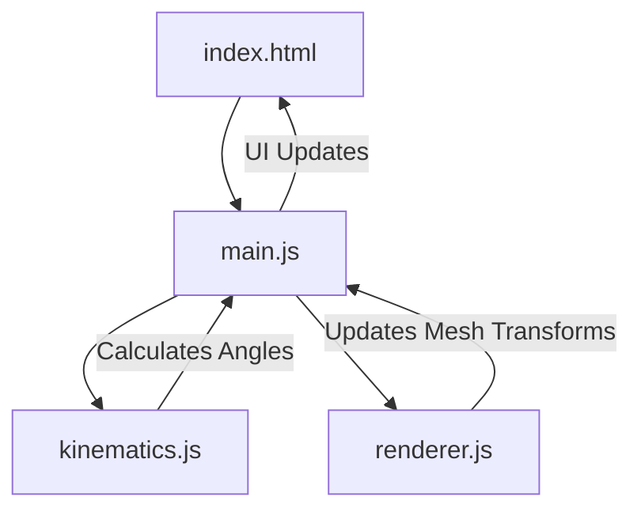

# RoboPulse | 3-DOF Robotic Arm Simulation

[](https://nodejs.org/)
[](https://vitejs.dev/)
[](https://threejs.org/)
[](LICENSE)

RoboPulse is a high-fidelity, web-based control system and simulation for a 3-Degree of Freedom (3-DOF) robotic arm. Designed for computer systems engineers, it implements precise Inverse Kinematics (IK) logic and real-time WebGL rendering to bridge the gap between abstract mathematics and physical motion.

---

## Key Features

- **Geometric IK Engine**: A pure JavaScript implementation of Inverse Kinematics, solving joint angles (Base, Shoulder, Elbow) for any (X, Y, Z) coordinate within the workspace.
- **Real-time WebGL Rendering**: High-performance 3D visualization using Three.js with dynamic lighting and hardware-accelerated segment transformations.
- **Premium Control Interface**: A sleek, dark-themed dashboard featuring glassmorphism, real-time telemetry, and tactical feedback.
- **Hardware-Ready Logic**: Modular architecture designed for easy integration with ESP32 or Arduino-based hardware controllers via WebSockets or Serial API.

---

## Project Architecture

The system follows a decoupled architecture ensuring separation of concerns between physics logic, rendering, and interaction.



- **`src/kinematics.js`**: Recursive geometric solvers for joint positions.
- **`src/renderer.js`**: Scene management, kinematics-to-transform mapping, and lighting.
- **`src/main.js`**: Central controller handling state management and event propagation.

---

## Technical Specifications

| Parameter | Specification |
| :--- | :--- |
| **DOF** | 3-Degrees of Freedom |
| **Joints** | Revolute (Base, Shoulder, Elbow) |
| **Workspace** | Spherical (Radius ≈ 3.5 units) |
| **Solver** | Geometric Inverse Kinematics |
| **Stack** | Vanilla TS, Three.js, CSS Power-Tokens |

---

## Getting Started

### Prerequisites
- [Node.js](https://nodejs.org/) (Environment: Windows/macOS/Linux)

### Installation
1. Clone the repository:
   ```bash
   git clone <repository-url>
   cd "Robotics project"
   ```
2. Run the development server (no install needed for this portable version):
   ```bash
   npx vite
   ```
3. Access the dashboard at `http://localhost:5173`.

---

## License
This project is licensed under the MIT License - see the `LICENSE` file for details.

Developed with passion for high-performance robotics engineering.
